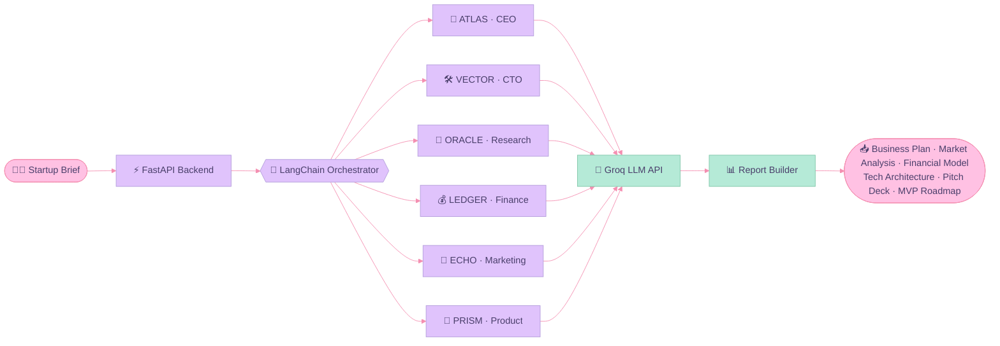
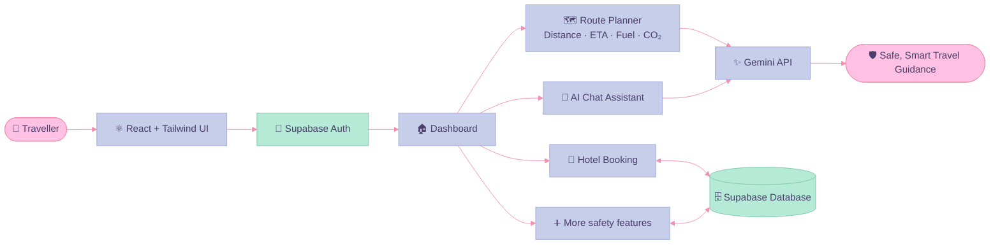
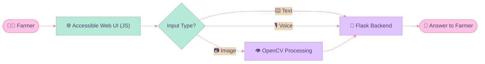
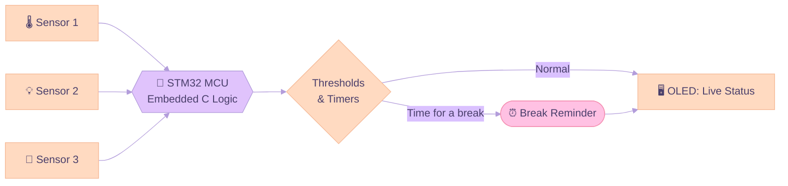
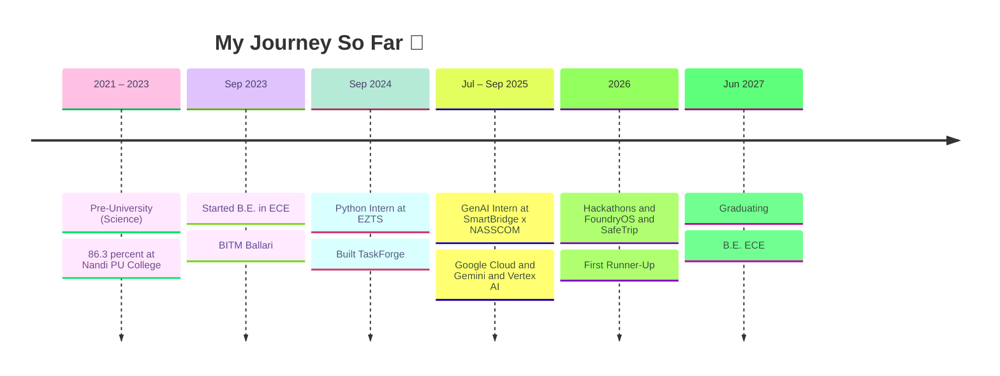

<!-- ═══════════════ HEADER ═══════════════ -->
<div align="center">


<a href="https://git.io/typing-svg">

</a>

<br/>


<a href="mailto:sayeedazaiba99@gmail.com"></a>
<a href="https://linkedin.com/in/sayeeda-zaiba"></a>
<a href="https://github.com/Sayeedazaiba"></a>

</div>

<br/>

<!-- ═══════════════ ABOUT ═══════════════ -->
## 🌷 About Me

```python
class SayeedaZaiba:
    def __init__(self):
        self.role      = "B.E. Electronics & Communication Engineering (2023 – 2027)"
        self.college   = "Ballari Institute of Technology and Management"
        self.cgpa      = 9.44
        self.focus     = ["Embedded Systems", "Generative AI", "Multi-Agent Systems", "Full-Stack Web"]
        self.location  = "Karnataka, India 🇮🇳"
        self.now       = "Building AI agents & smart embedded devices"
        self.learning  = ["Salesforce Agentforce", "Advanced LangChain", "STM32 peripherals"]
        self.fun_fact  = "I write code for both the cloud ☁️ and the circuit board 🔌"
```

> 💜 I live at the intersection of **hardware and AI**: from reading sensor data on an STM32 to orchestrating LLM agents in the cloud, I love making machines that actually *understand* the world.

<br/>

<!-- ═══════════════ TECH STACK ═══════════════ -->
## 🧁 Tech Stack

<div align="center">

**Languages**


**Frameworks · Libraries · Backend**


**Database · Tools · Cloud**


**Embedded & IoT**


**GenAI**


</div>

<br/>

<!-- ═══════════════ PROJECTS ═══════════════ -->
## 🌸 Featured Projects

<!-- ───────── FoundryOS ───────── -->
### 🏭 FoundryOS: Multi-Agent AI Orchestration System


A multi-agent orchestration platform that coordinates **6 specialised AI agents** to generate structured business reports across **4+ domains**. Give it a startup brief (industry, budget, audience, goals, stack) and watch the agents work live in a "War Room" dashboard with a thought stream, execution graph, telemetry and revenue forecast, then download the finished reports.

**Meet the agents:** 🎯 **ATLAS** (CEO) · 🛠️ **VECTOR** (CTO) · 🔮 **ORACLE** (Market Research) · 💰 **LEDGER** (Finance) · 📣 **ECHO** (Marketing) · 🧩 **PRISM** (Product Manager)



<div align="center">

### 🎬 Live Demo

FOUNDRYOS_VIDEO_LINK_HERE

<a href="[https://github.com/Sayeedazaiba/FoundryOS](https://github.com/user-attachments/assets/2923aa30-5201-46cb-95e9-c4f85dff3f94)"></a>
</div>

<br/>

<!-- ───────── SafeTrip ───────── -->
### 🧭 SafeTrip: AI-Powered Smart Travel & Safety Platform


A deployed **full-stack travel safety platform** with **6+ integrated features**, including hotel booking, an eco-aware route planner (distance, travel time, fuel use, CO₂ emissions and a sustainability score) and a Gemini-powered AI travel assistant, all behind secure **Supabase authentication** and database management.
🏆 **First Runner-Up, Presidency University Hackathon.**



<div align="center">

### 🎬 Live Demo

SAFETRIP_VIDEO_LINK_HERE

<a href="[https://github.com/Sayeedazaiba/SafeTrip](https://github.com/user-attachments/assets/49f81601-7135-49c8-9127-1f2281fd112b)"></a>
<!-- Add your live site button here when you have the URL:
<a href="YOUR_LIVE_SITE_URL"></a> -->
</div>

<br/>

<!-- ───────── AgriBot ───────── -->
### 🌾 AgriBot: Multimodal Farmer Query Support System


A multimodal Flask web app that lets farmers ask questions via **text, voice, or image** through an accessible interface.
🏅 **Top 20 teams, Smart India Hackathon (Internal College Round).**



<div align="center">

### 🎬 Live Demo

<a href="https://youtu.be/esj17ZA8Ep0">
  
</a>
<br/>
<a href="https://youtu.be/esj17ZA8Ep0"></a>
<a href="https://github.com/Sayeedazaiba/AgriBot"></a>
</div>

<br/>

<!-- ───────── Smart Wellness Desk ───────── -->
### 🪴 Smart Wellness Desk Assistant


An embedded wellness monitor integrating **3 sensors** for real-time workspace monitoring and **break reminders**, with live status shown on an **OLED screen**.



<div align="center">

<br/>
<a href="https://github.com/Sayeedazaiba/Smart-Wellness-Desk-Assistant"></a>
</div>

<br/>

<!-- ═══════════════ EXPERIENCE ═══════════════ -->
## 💼 Experience



| 🌷 Role | 🏢 Company | 📅 When | ✨ What I did |
|:--|:--|:--|:--|
| **Generative AI Intern** | SmartBridge, NASSCOM Virtual Internship | Jul – Sep 2025 | Completed **15+ Google Cloud labs** and built **10+ GenAI workflows** with Gemini & Vertex AI for prompt engineering, content generation and model evaluation |
| **Python Intern** | EZTS Trainings and Technologies Pvt. Ltd | Sep 2024 | Built **TaskForge**, a desktop task manager with **4+ features** (scheduling, deadline tracking, local storage) using a modular OOP architecture |

<br/>

<!-- ═══════════════ GITHUB STATS ═══════════════ -->
## 📊 GitHub Stats

<div align="center">


</div>

<br/>

## 🐍 Contribution Snake

<div align="center">
<picture>
  <source media="(prefers-color-scheme: dark)" srcset="https://raw.githubusercontent.com/Sayeedazaiba/Sayeedazaiba/output/github-snake-dark.svg" />
  <source media="(prefers-color-scheme: light)" srcset="https://raw.githubusercontent.com/Sayeedazaiba/Sayeedazaiba/output/github-snake.svg" />
  
</picture>
</div>

<br/>

<!-- ═══════════════ ACHIEVEMENTS ═══════════════ -->
## 🏆 Achievements

- 🥈 **First Runner-Up**, Presidency University Hackathon, for **SafeTrip**, recognised for a unique real-world travel safety solution and strong implementation
- 🌟 **Top 20 teams**, Smart India Hackathon (Internal College Round), for **AgriBot**
- 💫 **Shortlisted** for the 6-day **"She Innovates"** bootcamp at BITM Ballari

<div align="center">

</div>

<br/>

<!-- ═══════════════ CERTIFICATIONS ═══════════════ -->
## 📜 Certifications

<div align="center">


</div>

<br/>

<!-- ═══════════════ SOFT SKILLS ═══════════════ -->
## 🫶 Beyond Code

`Effective Communication` · `Active Listening` · `Team Collaboration` · `Problem Solving` · `Adaptability` · `Agile Project Management` · `Computer Networks`

<br/>

<!-- ═══════════════ CONTACT ═══════════════ -->
## 💌 Let's Connect

<div align="center">

**Open to internships, collaborations & hackathon teams in Embedded + AI ✨**

<a href="mailto:sayeedazaiba99@gmail.com"></a>
<a href="https://linkedin.com/in/sayeeda-zaiba"></a>

<br/><br/>

*"Code is poetry, circuits are the ink."* 🌸


</div>
